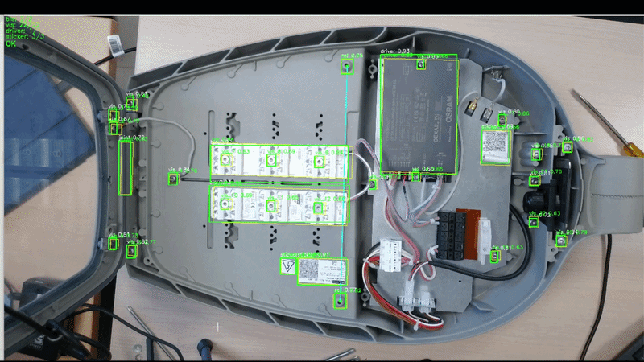

# Rotation-Independent Inspection System

A computer vision inspection system that uses dynamic coordinate transformation to achieve rotation-independent component placement verification, to facilitate the localization of missing parts by the operator.



## Features

- [**YOLO v7**](https://github.com/wongkinyiu/yolov7):  Custom Trained Object detection for components and reference points
- **Dynamic Coordinate System**: Real-time rotation and scale compensation
- **Rotation-Independent Inspection**: Works at varoius angle, distance, or position
- **Multi-Class Support**: Detects and verifies multiple component types
- **Flexible Configuration**: Uses existing YAML assembly rules
-

## Project Structure

```
main/
├── README.md
├── requirements.txt
├── config/
│   └── setting.py          # Central configuration settings
├── src/
│   ├── dynamic_coordinate_system.py  # Dynamic coordinate system utilities
│   ├── inspection_rotation_independent.py  # Main inspection logic
│   └── utils/
│       ├── add_boxes.py    # Box addition utilities
│       └── draw_boxes.py   # Box drawing/visualization
├── data/
│   ├── models/             # YOLO model files (.pt)
│   │   └── ... (model variants)
│   ├── rules/
│   │   ├── assembly_rules.yaml   # File generated from add_boxes.py / draw_boxes.py
│   │   └── rules.json
│   └── samples/            # Test images/videos
├── Training/               # Training related files
└── archives/               # Legacy/backup/test scripts
```

## Installation & Setup

### Prerequisites
```bash
# Install required packages from requirements.txt
pip install -r requirements.txt
```

### Required Files
- `data/models/***.pt` - Main YOLO model (configured in config/setting.py)
- `data/rules/assembly_rules.yaml` - Component position definitions
- `data/rules/rules.json` - Component count requirements


To use a different model, update `MODEL_PATH` in `config/setting.py`.

### Camera Setup
- Supports USB cameras (index X)
- Default resolution: 2688x1520 (configurable)
- Display window: 1280x720 (auto-resizable)

## Usage

### Basic Inspection
```bash
run as module
python -m src.inspection_rotation_independent
```


### Configuration Options
Configuration is centralized in `config/setting.py`:

```python
class Config:
    MODEL_PATH = "data/models/weight.pt"
    RULES_JSON = "data/rules/rules.json"
    YAML_PATH = "data/rules/assembly_rules.yaml"
    CAM_INDEX = 0
    CONF = 0.4
    REF_NAMES = {"ref", "ref_2"}
    OK_THRESH = 0.2
```

## Assembly Rules Format

### assembly_rules.yaml Structure
```yaml
components:
  bls_1:
    expected_area: [100, 200, 50, 50]  # x, y, width, height (pixels)
  bls_2:
    expected_area: [200, 200, 50, 50]
  vis_1:
    expected_area: [150, 300, 30, 30]
  driver_1:
    expected_area: [300, 400, 60, 80]
  sticker_1:
    expected_area: [100, 100, 20, 20]
```

### Auto-Generation from Production XML
```python
# Extract rules from production XML files
python tests/xmltorules.py production_file.xml
```

The `xmltorules.py` utility converts production XML files into the required `rules.json` format with configurable component detection rules for BLS and VIS components.

## 🔧 How It Works

### 1. Reference Point Detection
- YOLO detects reference points (`ref` class) on the object
- Any two reference points are used to establish coordinate system
- Reference points rotate with object automatically

### 2. Dynamic Coordinate System Creation
```
Reference Points → Coordinate System
┌─────────────┐           ┌─────────────┐
│  ● REF      │    →      │ Origin (0,0)│
│      ●      │           │ Object Space│
└─────────────┘           └─────────────┘
```

### 3. Position Transformation
- Expected positions (mm) → Pixel coordinates based on current rotation
- Automatic compensation for:
  - Object rotation (any angle)
  - Object scale (distance changes)
  - Object position (translation)

### 4. Component Verification
- YOLO detects components in current frame
- Positions transformed to object's coordinate system
- Distance calculated in millimeters
- Pass/Fail based on tolerance threshold

## Key Algorithms

### Coordinate Transformation
```python
# Rotation matrix for alignment
rotation_matrix = [
    [cos(-angle), -sin(-angle)],
    [sin(-angle),  cos(-angle)]
]

# Scale calculation
mm_per_pixel = known_distance_mm / pixel_distance

# Position transformation
object_mm = rotation_matrix @ (pixel_pos - ref_point) * scale
```

### Position Verification
```python
# Distance calculation
distance = sqrt((detected_x - expected_x)² + (detected_y - expected_y)²)

# Pass/Fail criteria
if distance <= tolerance_mm:
    status = "OK"
    color = (0, 255, 0)  # Green
else:
    status = "BAD"
    color = (0, 0, 255)    # Red
```


## Development & Customization

### Adding New Component Types
1. Train YOLO to detect new component
2. Add positions to `data/rules/assembly_rules.yaml`
3. Update component counts in `data/rules/rules.json`
4. Modify detection rules in `tests/xmltorules.py` if using XML conversion

### Modifying Tolerance
```python
# Edit these values in config/setting.py
class Config:
    OK_THRESH = 0.2  # Overlap threshold (0.0-1.0)
    CONF = 0.4       # YOLO confidence threshold
```
